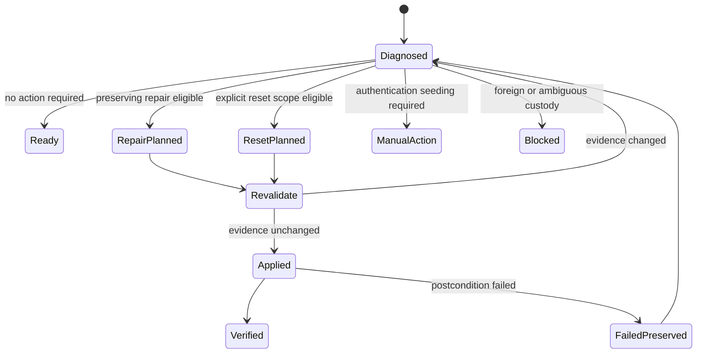

# Plan 0161: First-Class Profile Repair and Reset

Date: 2026-09-09

State: OPEN

Consolidation: required

Lane: P157

Parent: [Plan 0160](0160-2026-09-06-production-profile-identity-and-operational-readiness.md), W1

Depends on: [Plan 0137](0137-2026-08-28-profile-acquisition-recovery-and-lifecycle-reliability-plan.md), [Plan 0144](0144-2026-08-31-lease-authority-coordination-and-revocation-plan.md)

Overlaps: [Plan 0159](0159-2026-09-05-client-recovery-logging-and-remote-view-remediation.md)

Branch: `plan/profile-permissions-and-request-provenance`

Source baseline: `08c7bcff6f55`

Target: `main`

Integration: merge through the existing P157 branch

Current execution status: [RUNBOOK.md](../../../RUNBOOK.md)

## Objective and operator outcome

Make stored browser-profile recovery a first-class Agent Browser capability.
An operator or software client supplies one profile ID and receives a joined
diagnosis, one supported preserving repair, or an explicitly scoped reset.
They do not need to understand lease internals, choose among unrelated recovery
APIs, edit Service State, delete Chrome lock files, or invent a launch sequence.

The first useful outcome is a preserving repair for the failure observed by
Books Receipts on BILL: recovery chose a stale owner route, then stale Chrome
singleton-lock metadata blocked the replacement launch. One profile operation
must diagnose both causes, prove the allowed corrections, preserve the
authenticated profile and complete one bounded recovery launch.

QBO supplies the second outcome class. When the profile is structurally healthy
but authentication is absent or stale, Agent Browser must recommend or apply an
authentication-evidence reset and enter the existing detached manual-seeding
workflow without replacing the stored profile.

This plan is a bounded implementation plan for Plan 0160 W1. It does not close
Plan 0160 A1 through A4 or AX by itself.

## Authority and boundaries

The operator requested this plan and established profile ownership and identity
repair as the highest priority. Source, contracts, documentation, disposable
fixtures, candidate builds and isolated validation remain within the standing
Plan 0160 implementation authority.

This plan does not authorize a full profile-data reset of a production profile,
credential deletion, tenant action, payment action, foreign-browser closure,
broad process cleanup, formal release or unrelated Service State migration.
The Books Receipts recovery already in progress remains an independent urgent
operation and should not wait for this implementation.

## Current state

Agent Browser already has strong but fragmented primitives:

- `service_profile_recovery.rs` owns sealed profile recovery plans, identity
  joins, mitigation actions, idempotent apply and a bounded acquisition retry.
- Profile lease APIs expose acquire, rejoin, renew, release, reconcile and
  recover operations.
- Service configuration exposes profile upsert, freshness update, seeding
  handoff update and profile delete.
- Browser lifecycle, retained-state repair and route repair expose narrower
  maintenance actions.
- The dashboard presents profile allocation and lease controls, but requires an
  operator to understand which lower-level operation applies.

The missing product boundary is one profile aggregate that diagnoses the whole
profile and selects only an evidence-supported transition. `service_profile_delete`
is configuration deletion and must not be presented as reset.

Graphiti discovery found prior evidence that stale Chrome processes were cleaned
only after exact profile, PID and start-token proof. That is advisory history;
the implementation and tests must establish the current contract from source.

## Consolidated batch

The coherent batch is the profile aggregate and its preserving lifecycle:

1. joined profile diagnosis;
2. sealed, idempotent preserving repair;
3. explicitly scoped runtime and authentication reset;
4. the CLI, HTTP, MCP, generated client and dashboard surfaces for those
   operations;
5. causal logging and focused disposable acceptance for the BILL and QBO
   failure classes.

The batch reuses the existing recovery planner, repository transactions,
profile lease authority and seeding lifecycle. It must not create a second
ownership evaluator or a parallel Service State writer.

Full profile-data reset and supported restore are a later slice in this plan.
They do not delay delivery of preserving repair, runtime reset or authentication
reset. Remote-view provider repair remains owned by its existing actions; the
profile diagnosis may report it as a separate blocker but does not absorb
provider mutation.

## Public contract

### CLI

Add these commands under the existing profile command family:

```text
agent-browser service profiles <profile-id> diagnose
agent-browser service profiles <profile-id> repair
agent-browser service profiles <profile-id> repair --apply --plan <absolute-path>
agent-browser service profiles <profile-id> reset --scope runtime
agent-browser service profiles <profile-id> reset --scope runtime --apply --plan <absolute-path>
agent-browser service profiles <profile-id> reset --scope authentication --target-service-id <id>
agent-browser service profiles <profile-id> reset --scope authentication --target-service-id <id> --apply --plan <absolute-path>
```

Planning is the default for repair and reset. Apply accepts the sealed plan or
its exact serialized digest and never recomputes a broader action set silently.
JSON output retains the full contract. Text output names the diagnosis state,
preserved data, proposed effects, blockers, manual action, request ID and job ID.

### HTTP

Add profile-scoped routes:

```text
GET  /api/service/profiles/<id>/diagnosis
POST /api/service/profiles/<id>/repair/plan
POST /api/service/profiles/<id>/repair/apply
POST /api/service/profiles/<id>/reset/plan
POST /api/service/profiles/<id>/reset/apply
```

All mutations use the serialized Service worker queue. Apply uses the same
caller context and authentication boundary as the existing recovery primitives.

### MCP and generated client

Add parity actions and helpers:

```text
service_profile_diagnose
service_profile_repair_plan
service_profile_repair_apply
service_profile_reset_plan
service_profile_reset_apply

diagnoseServiceProfile()
planServiceProfileRepair()
applyServiceProfileRepair()
planServiceProfileReset()
applyServiceProfileReset()
```

Keep `SERVICE_REQUEST_ACTIONS`, the service request schema, HTTP dispatch, MCP
tool declarations, generated types and client exports aligned where the action
is carried through the generic service request surface. Prefer dedicated profile
routes and tools when they provide a clearer typed contract, while retaining one
shared Rust command owner.

### Dashboard

Each stored profile row receives one `Diagnose` action. The diagnosis view shows:

- overall state: `ready`, `repairable`, `manual_action`, `blocked`, or `reset_available`;
- the current profile, browser, process, session, tab, lease, principal,
  readiness and remote-view joins;
- each finding as blocking or advisory with its evidence and recourse;
- one recommended repair or reset plan;
- a preservation and effects summary before apply; and
- the returned request, job, event and incident links after apply.

Use shadcn dialogs. Repair and reset are separate controls. Full profile-data
reset must never share the ordinary repair confirmation.

## Diagnosis model

Diagnosis is read-only and returns one stable schema with these sections:

| Section | Required evidence |
| --- | --- |
| Profile | canonical ID, revision, user-data path digest, allocation mode, browser build, sharing and target services |
| Runtime | browser, PID, process start token, executable digest, boot identity, session, targets and CDP posture |
| Ownership | owner generation, lease revision, principal provenance, capability reference, subordinate work and conflicts |
| Chrome locks | lock names, parsed targets where available, matching process evidence and stale-proof verdict |
| Readiness | target authentication and freshness state, monitor evidence, manual-seeding state and recommended action |
| Presentation | headed posture, stream and handoff readiness, with provider defects classified separately |
| Decision | dominant blocker, eligible action, proposed effects, preserved data, manual step and exact recourse |
| Trace | correlation ID, source/build identity and links to related requests, jobs, events and incidents |

Diagnosis must distinguish an operational block from an advisory historical
finding. A healthy stopped shared profile should report normal launch, not
repair. Missing authentication should report manual seeding, not ownership
failure. Unknown physical occupancy must remain blocked.

## Repair semantics

Repair always preserves the profile directory, cookies, credentials, extensions
and authenticated site state. The planner selects zero or more actions from a
closed registry owned by the existing profile recovery module:

- refresh a stale canonical profile or shared-service projection;
- select the exact current owner route instead of a stale route;
- rejoin or reconcile the exact principal and owner-generation binding;
- repair stale service-owned browser, session or tab references;
- remove Chrome singleton locks only when the matching process identity is
  proven absent;
- reconcile target-readiness metadata only from current bounded evidence; and
- perform one recovery launch when the sealed plan declares launch as its final
  transition.

Apply rechecks profile revision, Service State revision, lease revision, owner
generation, browser and process identity, boot identity, lock evidence and
subordinate work. Any changed or ambiguous evidence stops before effects and
returns a new diagnosis recommendation. It never changes profile labels to
bypass access, claims a foreign browser, kills an unknown process, or deletes
an unproven lock.

Replaying a completed plan returns the original receipt. Replaying an expired,
changed or partially applied plan returns typed status and safe recourse rather
than beginning a second launch.

## Reset semantics

Reset always requires an explicit scope.

| Scope | Effects | Preserved | Required gates |
| --- | --- | --- | --- |
| `runtime` | Retire the exact service-owned browser lane and its active runtime bindings; clear proven-stale locks; leave the profile stopped and launchable | Profile config, directory, cookies, credentials, extensions and readiness evidence | Exact owner, process, session, tab and peer-survival proof; no foreign or ambiguous custody |
| `authentication` | Remove authentication and freshness evidence only for one target service; create or advance its detached manual-seeding handoff | Profile directory, browser data, other targets and account bindings | Exact target, profile revision and readiness evidence; response must say browser cookies are not erased |
| `profile-data` | Move the exact profile directory into a recoverable backup and create a new empty directory bound to the same reviewed profile configuration | Sealed backup, profile identity and policy configuration | No live browser, exact directory custody, backup verification, explicit destructive confirmation and supported restore |

The initial delivery includes `runtime` and `authentication`. `profile-data`
stays disabled until the same slice implements and tests a first-class restore
operation, backup retention rules and failure rollback. Profile deletion remains
a separate configuration operation.

## State machine



No failure edge authorizes an automatic retry. A repair whose final launch has
an uncertain effect records that uncertainty and returns diagnosis recourse.

## Work units

| Unit | Work and expected write surface | Exit evidence | Dependency |
| --- | --- | --- | --- |
| W0 | Freeze the aggregate schemas, action registry, states, reset scopes and BILL/QBO fixtures. Inspect existing coverage before adding tests. | Red contract fixtures distinguish stale-owner, stale-lock, auth-reset, foreign-owner and healthy-profile cases. | Plan ready |
| W1 | Implement the read-only diagnosis owner in the existing profile recovery domain. Add CLI, HTTP, MCP and generated-client read parity. | One profile ID produces the same joined diagnosis on every surface with causal identity and no state mutation. | W0 |
| W2 | Implement sealed preserving repair by composing existing mitigation actions and exact stale-lock proof. | BILL fixture repairs stale routing and stale locks, preserves auth and completes one launch; changed or foreign custody refuses before effects. | W1 |
| W3 | Implement scoped runtime and authentication reset using the same planner, repository transaction and receipt format. | Runtime reset leaves an exact profile stopped and launchable with peers preserved; authentication reset changes only the selected target and starts seeding. | W1 |
| W4 | Add dashboard diagnosis, repair and scoped reset flows. Update all user-facing docs required by AGENTS.md. | An operator can understand and execute the supported action without selecting lower-level lease primitives. | W1 through W3 |
| W5 | Run changed-surface gates, build one candidate, install only under the parent plan's runtime gate, and verify disposable then consumer outcomes. | Final evidence table binds source, binary, support generation and actual outcome; no fixture residue or hidden reset. | W2 through W4 |
| W6 | Design and implement profile-data reset plus restore as a separately reviewed destructive slice. | Backup, reset, failed-apply rollback and restore pass with disposable profiles. | W5; separate action-specific production authority for any live use |

## Acceptance matrix

| Case | Expected result |
| --- | --- |
| Healthy BILL-like shared profile | Diagnosis recommends normal launch and repair makes no changes. |
| Stale owner route plus stale locks | One repair plan binds the current proven route, removes only proven-stale locks and launches once with authentication intact. |
| Live lock holder | Repair refuses lock removal and reports the matching PID, start token evidence and safe next action. |
| Legacy-principal lease | Repair reuses the ordinary shared-local self-identified client where policy permits and restores exact physical ownership proof. |
| Changed owner or profile revision | Apply refuses before effects and asks for a fresh diagnosis. |
| Peer in shared profile | Repair and runtime reset preserve the peer browser, tabs, policy and handles. |
| QBO-like missing authentication | Diagnosis recommends authentication reset or seeding; reset changes only that target's evidence and returns the seeding handoff. |
| Idempotent replay | A repeated apply returns the original terminal receipt and creates no second browser or reset. |
| Interrupted launch | The result records uncertain effect, exact correlation and supported reconciliation without blind retry. |
| Profile-data reset attempt in initial delivery | Refused as unavailable until restore and backup acceptance are installed. |

## Delivery sequence and budget

Use three bounded delivery packets. Cumulative planning, implementation, review,
validation and documentation time target is three hours before reassessment.
No packet or worker resets that cumulative allowance.

1. **Packet A, 45 minutes:** freeze schemas and disposable red fixtures, then
   implement diagnosis through the Rust owner plus one cheapest public surface.
   Stop if current source cannot provide a unique physical profile identity;
   record the missing join rather than adding a heuristic.
2. **Packet B, 75 minutes:** implement preserving repair and runtime reset at the
   Rust transaction seam. The BILL combined failure is the acceptance target.
   Stop after one fixture correction or one failed implementation approach that
   reveals a new architecture dependency.
3. **Packet C, 60 minutes:** add authentication reset, remaining public surfaces,
   dashboard and required docs; run focused checks and the selected integration
   gates once. Build and installation occur only if enough time remains for the
   whole candidate and post-install verification sequence.

At two consecutive checkpoints without outcome progress, or at the three-hour
bound, stop the current tactic and reconcile the remaining work. Do not spend a
fourth packet on broad refactoring, historical evidence inventory or repeated
builds. Full profile-data reset is excluded from this allowance.

## Worker assignments and economical routing

| Lane | Route | Exact scope and output | Stop condition |
| --- | --- | --- | --- |
| Architecture and integration | Primary | Own schemas, Rust aggregate boundary, safety decisions, integration and acceptance. | Reassess at packet bounds or changed custody semantics. |
| Focused implementation | Sol or Terra, medium, only when a disjoint file owner is useful | One bounded public adapter or reset implementation from frozen types and tests. Return patch and focused results. | First ambiguity requiring schema or safety redesign. |
| Mechanical synchronization | Luna, low or medium | Generated client types, parity lists and required documentation after contracts freeze. | Any semantic mismatch or generator failure. |
| Closed-world review | Fresh economical reviewer if available and useful | Review only stale-lock proof, foreign-owner rejection, destructive-scope isolation and idempotency against the frozen matrix. | Return one candidate set; no broad rediscovery. |

Use deterministic generators and validation selectors before model work. The
primary keeps all runtime effects and final acceptance. Record requested and
effective model, elapsed time, accepted output and rework only when delegation
actually occurs.

## Validation

Use focused tests during implementation. Before merge readiness, run the checks
selected from the complete batch baseline with:

```text
pnpm validation:select -- --base 08c7bcff6f55
```

Because the expected batch changes Rust service contracts, generated clients,
dashboard actions and user-facing behavior, the final batch must include:

- Rust formatting and strict workspace Clippy through `scripts/ci/cargo-safe.sh`;
- focused profile recovery, profile lease, service dispatch and stale-lock tests;
- service request action, HTTP/MCP parity, generated client and JavaScript type
  coverage checks;
- dashboard profile and inspector action checks;
- README, CLI help, installed skill and docs-site synchronization;
- dashboard and docs builds where selected; and
- one serial disposable headed launch for the combined BILL recovery case with
  exact process, profile, peer and residue readback.

Do not run production BILL or QBO business actions as a test. A harmless
authenticated URL/title or bounded readiness probe may establish profile
usability under the parent plan's runtime authority.

## Evidence and exit

RUNBOOK.md remains the single current requirement-to-evidence table. Each packet
records implemented, qualified, installed and user-verified states separately.
Receipts bind the plan digest, profile ID, profile revision, Service State
revision, owner generation, process start token, source commit, executable and
support digests, proposed effects, preserved data and postconditions. Secrets,
raw cookies, capabilities and private page content stay out of receipts.

The initial milestone is complete only when all of these are true on one exact
candidate:

1. every public surface returns the same joined diagnosis and supported action;
2. the BILL combined fixture completes one preserving repair and launch;
3. live or ambiguous lock ownership refuses before cleanup;
4. runtime reset preserves browser data and peers;
5. authentication reset affects only one target and enters manual seeding;
6. changed evidence and idempotent replay behave safely;
7. request, job, event, incident and first causal decision are traceable; and
8. required docs and changed-surface gates pass.

Installed acceptance requires the selected runtime to report the exact candidate
identity and one disposable end-to-end pass. Consumer BILL usability is separate
user-workflow evidence. Full profile-data reset remains incomplete until W6 and
does not prevent closing the initial preserving-remediation milestone.

## Non-goals

- weakening profile access policy or physical ownership proof;
- using `unsafe_claim_any` as ordinary repair;
- deleting or recreating profiles to make diagnostics green;
- automatic blind retry after an uncertain launch;
- general provider, Guacamole, route-pool or display repair;
- tenant business operations or payment actions;
- rewriting historical failure evidence; or
- formal release work.

## Definition of done

Plan 0161 closes when the initial milestone is merged, installed and verified,
the RUNBOOK.md evidence table has no unresolved blocker for diagnose,
preserving repair, runtime reset or authentication reset, and W6 is either
completed under its separate destructive boundary or moved into a specifically
named successor without obscuring the delivered first-class lifecycle.
